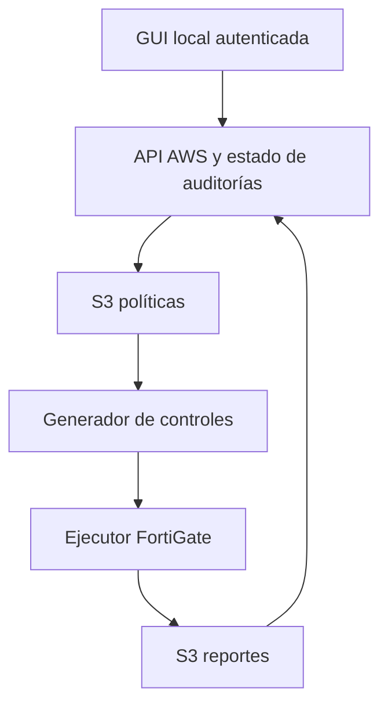

# Especificación de GUI — PPS AWS/Fortinet

**Versión:** 1.1 · **Fecha:** 28/09/2026 · **Estado:** propuesta para implementación  
**Referencia:** repositorio `Santiago-sz/PPS-AWS-Fortinet-`, rama `master`; captura FortiSIEM Security Posture adjunta por el solicitante.

## 1. Objetivo y alcance

Crear una **aplicación de escritorio instalada y ejecutada localmente** para que un analista cargue políticas de seguridad de una organización, lance o consulte una auditoría del FortiGate y examine la postura resultante en un tablero similar al de la captura. La aplicación se conecta de manera segura a AWS para almacenar políticas, ejecutar el pipeline existente y obtener reportes; requiere conexión a Internet o a la red institucional para esas operaciones. Debe poder ir desde cada resultado hasta el control evaluado, su evidencia y la cláusula de la política que lo originó. La aplicación es **de observación y evaluación**; una acción de remediación automática queda fuera del MVP.

**Alcance comprobado del repositorio:** `policy_generator` se dispara con un PDF/DOCX bajo `policies/` en S3; extrae texto, propone comprobaciones, genera y valida un script; `audit_executor` vuelve a validar, consulta la API de FortiGate y entrega `reports/{run_id}/report.json` y `.md`. También hay un evaluador NIST CSF 2.0 programado (legado). La aplicación debe usar el flujo de políticas como fuente principal. El nombre «análisis del sistema» designa, en el MVP, la configuración y los endpoints de FortiGate que este flujo realmente consulta. **No equivale todavía a inventario AWS, FortiCNAPP o una evaluación integral de todos los activos institucionales.**

## 2. Roles

| Rol | Permisos en la GUI |
|---|---|
| Administrador | Alta de organización y conectores; administrar usuarios, retención, umbrales y credenciales mediante un flujo seguro. |
| Analista | Cargar/versionar políticas, iniciar evaluaciones, consultar hallazgos, exportar reportes y registrar seguimiento. |
| Lector/auditor | Consultar y exportar evaluaciones y evidencias autorizadas; sin carga ni ejecución. |

Toda consulta queda limitada a la organización asignada. Si se despliega para una sola organización, conservar `organization_id` en los contratos para que la autorización sea explícita.

## 3. Navegación y pantallas

Menú lateral o superior: **Resumen · Políticas · Análisis · Resultados · Configuración**. Encabezado persistente con organización, entorno, dispositivo objetivo, usuario, última actualización y estado del conector. Fecha y hora local en la GUI; fecha UTC en los registros.

### 3.1 Políticas de seguridad

**Listado:** nombre, versión, alcance, autor/cargador, fecha, formato, hash SHA-256, estado (`cargada`, `procesando`, `lista`, `sin controles verificables`, `error`), cantidad de controles detectados y última evaluación. Búsqueda y filtros por estado, fecha y dispositivo; acceso a versiones y al documento original sujeto a permisos.

**Carga:** seleccionar o arrastrar PDF/DOCX desde el equipo; ingresar nombre, versión, descripción y alcance; elegir FortiGate objetivo; mostrar tamaño y tipo permitidos definidos en configuración; confirmar. La aplicación valida preliminarmente formato y tamaño, calcula el hash y obtiene autorización temporal para subir el archivo a una clave opaca como `policies/{org_id}/{policy_id}/{version_id}.pdf`. El servicio en AWS valida identidad, pertenencia, permisos, tamaño, tipo y hash, registra metadatos y confirma la subida. S3 dispara el generador. No guardar claves AWS permanentes en el equipo. PDF escaneado, cifrado, corrupto o sin texto debe informar «No se pudo extraer texto»; OCR sería una extensión posterior.

**Detalle:** vista previa del documento, versiones, cláusulas y controles verificables propuestos (ID, requisito, cláusula/página/cita, endpoint FortiGate, criterio de evaluación). Los controles generados por IA son **propuestas trazables**, no equivalen a una aprobación humana. Antes de marcar una política como «aprobada para auditoría» se propone revisión humana de controles y alcance. Como el flujo actual genera y ejecuta en una sola subida, separar aprobación y ejecución requiere modificar su orquestación (véase §7).

### 3.2 Análisis del sistema

**Preparación:** política y versión, FortiGate objetivo, estado de la conexión local con AWS, conectividad del ejecutor AWS con FortiGate y fecha del último sondeo, alcance, número estimado de controles y aviso de uso del modelo de IA. Botón «Iniciar análisis» con prevención de doble clic e idempotencia. El flujo actual empieza con la subida del archivo y corre automáticamente: para ofrecer un botón independiente hay que separar `generar controles` de `ejecutar evaluación`, o mantener el MVP como «Cargar e iniciar» y ofrecer «Volver a analizar» mediante un nuevo disparador en AWS. No simular que existe un endpoint de inicio en el repositorio. **El FortiGate lo consulta la Lambda en AWS, no la aplicación local**; verificar conectividad desde ese entorno.

**Progreso:** línea temporal `recibido → extrayendo → generando controles → validando → recopilando evidencia → elaborando reporte → finalizado`. Cada fase muestra hora, explicación y error accionable. El progreso es por **fases verificadas**, nunca un porcentaje inventado. La invocación asíncrona de Lambda (`InvocationType=Event`) no significa que la evaluación terminó.

**Resultados:** estado `completed`, `truncated`, `could_not_audit`, `generation_failed` o `no_verifiable_controls`. `truncated` conserva hallazgos parciales y un aviso prominente; `could_not_audit` no se presenta como sistema conforme. Permitir reintento con una nueva ejecución, manteniendo intacta la anterior.

### 3.3 Tablero de relevamiento

La composición de escritorio reproduce la **jerarquía de información** de la imagen adjunta, sin copiar la marca FortiSIEM ni asumir que sus datos ya existen:

| Zona de la referencia | Widget propuesto | Fuente MVP / condición |
|---|---|---|
| Overall Grade | «Postura general»: controles aprobados, fallidos, indeterminados y no aplicables; estado de cobertura y fecha | `report.json` + `manifest.json`. Una letra A–F requiere fórmula publicada y controles comparables; por defecto mostrar porcentajes y conteos. |
| Posture Category Grade | «Resultados por categoría» con estado y cobertura | Añadir `category` al contrato de cada check aprobado; mientras falte, agrupar por política/sección del documento y rotularlo así. |
| Top Devices by Lowest Audit Score | «Activos con más fallos» | MVP con un solo FortiGate: mostrar una ficha del dispositivo. Ranking solo después de incorporar inventario, identificador y resultados de varios dispositivos. |
| Failed Security Checks by Score | Tabla principal de hallazgos fallidos: control, severidad, dispositivo, evidencia, cláusula, fecha, estado de seguimiento | `findings` y `manifest.checks`; severidad y puntuación exigen campos/criterios adicionales. Hasta entonces, ordenar por política, control y fecha, sin inventar score. |
| Device Coverage | «Cobertura de evaluación»: controles previstos, evaluados, indeterminados y no evaluados por límite o fallo | Manifest + report + estado de ejecución. Cobertura por tipo de dispositivo solo con nuevas fuentes de inventario. |

**Diseño:** ventana redimensionable de escritorio, fondo neutro, tarjetas de alto contraste, tres columnas si el ancho lo permite (resumen, categorías, activos), tabla de hallazgos a ancho completo y cobertura debajo. Filtros arriba: organización, política/versión, dispositivo, rango de fechas, estado, categoría; acción «Exportar» a un archivo elegido mediante diálogo nativo. En ventanas estrechas, dos o una columna y tabla desplazable con encabezados visibles. Color y etiqueta textual para `aprobado`, `fallido`, `indeterminado`, `no aplicable` y `parcial`; nunca solo color. Cada métrica muestra denominador y hora del último reporte.

**Detalle al seleccionar un hallazgo:** ID de control, resultado, evidencia sin secretos, endpoint consultado, cláusula exacta/cita/página, hash de versión de política, dispositivo, `run_id`, hora y estado de trazabilidad. Si `traceable=false`, mostrar «Sin referencia verificable» y no construir una cita ficticia. Seguimiento manual opcional: responsable, comentario y estado (`nuevo`, `en revisión`, `aceptado`, `resuelto`), separados del resultado técnico inmutable.

## 4. Reglas de cálculo y presentación

- Universo: checks del `manifest` de una ejecución. Resultado `pass`, `fail`, `not_applicable` o `indeterminate`; los faltantes se muestran como `no_evaluado`. Distinguir hallazgo observado de check esperado.
- **Cobertura** = checks con resultado `pass` o `fail` o `not_applicable` o `indeterminate` / checks previstos. Es una métrica de ejecución, no de cumplimiento. Duplicados por `check_id` requieren una política explícita de resolución; se propone marcar anomalía y retener las entradas para investigación.
- **Cumplimiento observado** = `pass / (pass + fail)` cuando el denominador es mayor que cero. Mostrar junto al número las cantidades excluidas de `not_applicable`, `indeterminate` y `no_evaluado`. Si el reporte está truncado o falló, el porcentaje lleva etiqueta **parcial/no confiable como postura total**; si no hay checks aplicables, «Sin datos suficientes».
- A–F, «audit score», ponderaciones por severidad y tendencia histórica **no existen como contrato de origen**: son una decisión de producto posterior. Si se aprueban, versionar la fórmula y guardar `scoring_version` por ejecución. Una ejecución jamás debe pasar a «conforme» por ausencia de hallazgos cuando su estado no sea `completed`.
- Comparar tendencias solo entre la misma política/versionado, dispositivo, conjunto de controles y versión de fórmula; de lo contrario avisar que los períodos no son directamente comparables.

## 5. Modelo mínimo de datos

| Entidad | Campos indispensables |
|---|---|
| Organization | `id`, `name`, `timezone`, `created_at` |
| UserMembership | `user_id`, `organization_id`, `role` |
| Device | `id`, `organization_id`, `name`, `type=fortigate`, `host_ref`, `connector_status`, `last_checked_at` |
| Policy | `id`, `organization_id`, `name`, `description`, `scope`, `active_version_id` |
| PolicyVersion | `id`, `policy_id`, `version_label`, `s3_key`, `sha256`, `mime_type`, `size`, `uploaded_by`, `uploaded_at`, `review_status` |
| AuditRun | `id` propio de GUI, `run_id` del pipeline nullable al principio, `organization_id`, `policy_version_id`, `device_id`, `status`, `phase`, `started_at`, `finished_at`, `failure_reason`, `manifest_key`, `report_key` |
| Check / Finding | `check_id`, `run_id`, `status`, `evidence`, `clause_ref`, `traceable`, `endpoints_used`, campos opcionales `category`/`severity` cuando se implementen |
| FollowUp | `finding_id`, `owner_id`, `status`, `comment`, `updated_at`; no modifica el reporte fuente |

Usar una base de datos para índices, filtros, permisos, estados y trazabilidad; S3 conserva documentos, manifests y reportes. No exponer claves S3 arbitrarias al cliente. Una única cuenta/organización puede usar el mismo esquema.

## 6. Integración de la aplicación local con AWS

La GUI se empaqueta como aplicación de escritorio (por ejemplo, Python + PySide6, consistente con el código Python actual; elección definitiva sujeta al entorno de despliegue). Se ejecuta en el equipo del analista; conserva preferencias de interfaz y una caché local mínima y cifrada de metadatos/resultados previamente consultados, con expiración y opción de borrado. **No hospeda un servidor accesible a otros equipos.** Las operaciones compartidas y sensibles usan una API pequeña alojada en AWS (API Gateway + Lambda, por ejemplo), que valida autorización y consulta S3/estado persistido. Una alternativa de acceso AWS directo con credenciales temporales federadas exige delimitar IAM por organización y no se adopta como contrato del MVP. Sin conexión, se pueden ver resultados ya guardados localmente con fecha y aviso «Datos sin actualizar»; subir políticas, iniciar auditorías y actualizar reportes requieren conexión.

### 6.1 Contrato remoto propuesto (a implementar en AWS)

| Método y ruta | Acción / respuesta |
|---|---|
| `POST /api/policies` | Crear metadatos de política/versión y obtener `upload_id` + autorización temporal para subir a S3; permisos de analista. |
| `POST /api/policies/{id}/versions/{versionId}/complete-upload` | Confirmar tamaño/hash/objeto y registrar recepción; idempotente. El evento S3 puede llegar antes o después: correlacionar por clave y versión. |
| `GET /api/policies?status=&q=` / `GET /api/policies/{id}` | Listado y detalle de versiones/controles con paginación. |
| `POST /api/audits` | Iniciar/reiniciar evaluación cuando exista disparador desacoplado; recibe `policy_version_id`, `device_id`, `Idempotency-Key`; devuelve `202` y `audit_id`. Para el MVP de disparo al subir, la operación de carga crea automáticamente el audit pendiente. |
| `GET /api/audits/{auditId}` | Fase, estado, timestamps, fallos y enlaces lógicos; sondeo desde la aplicación cada 3–5 s mientras está activa, con backoff y reanudación tras reiniciar el programa. |
| `GET /api/audits/{auditId}/results` | Resumen, checks y hallazgos paginados, cobertura, trazabilidad. Nunca muestra credenciales ni el script generado. |
| `GET /api/dashboard?policyVersionId=&deviceId=&from=&to=` | Agregados calculados en servidor y procedencia de datos. |
| `GET /api/audits/{auditId}/export?format=json|md` | Descarga autorizada de los artefactos correspondientes. |
| `PATCH /api/findings/{id}/follow-up` | Seguimiento humano con auditoría de actor y fecha. |

Respuestas de error con `code`, `message`, `correlation_id`; paginar listas; validar permisos por organización y dispositivo en **cada** endpoint remoto. La aplicación local no puede elegir libremente bucket, función Lambda, ARN o `run_id` de otra organización. Si se usa URL temporal de S3, emitirla con plazo, clave y operación acotados; tratar el equipo cliente como no confiable para la autorización.

**Ejemplo de respuesta de resultados (contrato de GUI, no formato existente del repositorio):**

```json
{
  "audit_id": "aud_123",
  "run_id": "...",
  "status": "truncated",
  "policy_version": "2.1",
  "device": {"id": "fgt_01", "name": "FortiGate laboratorio"},
  "counts": {"expected": 12, "pass": 5, "fail": 2, "indeterminate": 1, "not_applicable": 0, "not_evaluated": 4},
  "coverage_percent": 66.67,
  "compliance_percent": 71.43,
  "partial": true,
  "findings": [{"check_id": "CHK-01", "status": "fail", "traceable": true, "clause_ref": {"page": 3, "quote": "..."}}]
}
```

## 7. Integración y cambios requeridos en el proyecto

1. **Aplicación de escritorio + servicio AWS:** GUI local (por ejemplo PySide6) y servicio autenticado en AWS (por ejemplo API Gateway + Lambda) entre la aplicación, base de datos, S3 y ejecutores. La GUI no invoca directamente `policy_generator`, no consulta FortiGate y no accede a Secrets Manager. Definir instalador, sistemas operativos soportados, actualización y firma del paquete.
2. **Correlación de eventos:** actualmente el generador crea un `run_id` UUID *dentro* de la Lambda tras el evento S3. Para mostrar progreso desde que el usuario sube un archivo, registrar un `audit_id` previamente y transportar un identificador de correlación estable mediante la clave/metadata del objeto o una cola; persistir transiciones del generador y ejecutor. Leer `report.json` en S3 como resultado final no ofrece por sí solo todas las fases intermedias.
3. **Disparadores:** en el código actual subir el PDF/DOCX genera y ejecuta inmediatamente. Si se requiere revisión de controles antes de analizar, separar fases y persistir una propuesta aprobable. Si no, el MVP debe comunicar que «Cargar política» inicia la auditoría.
4. **Modelo ampliado:** `report.json` ya contiene `run_id`, `policy_key`, `timestamp`, `status`, `truncated`, `findings`, `notes` y posible `failure_reason`; `manifest.json` contiene checks y hash de política. Incorporar `organization_id`, `device_id`, versión, categoría y severidad solo con migración de esquema validada. Evitar inferir identificadores de dispositivos a partir del nombre del archivo.
5. **Configuración previa al despliegue:** reconciliar formato JSON de Secrets Manager con lectura de `SecretString` usada por handlers (token y API key); no cargar credenciales reales mediante `secret_string` en Terraform state. Cerrar acceso administrativo expuesto del FortiGate y verificar TLS/alcance de red antes de operar con políticas institucionales.



## 8. Seguridad, accesibilidad y operación

- Autenticación institucional/OIDC si está disponible, mediante flujo apropiado para cliente de escritorio (Authorization Code + PKCE con navegador del sistema); autorización RBAC en AWS por organización; tokens de corta duración en almacén seguro del sistema operativo, cierre de sesión y registro de acciones de carga, evaluación, exportación y seguimiento. Nunca incluir claves permanentes en instalador o archivo de configuración.
- Comunicaciones TLS con AWS y validación de certificados. Documentos y reportes privados, cifrados y con retención definida; autorización temporal de subida/descarga. Analizar malware según capacidad institucional. Nunca registrar contenido completo de políticas, credenciales, cabeceras Authorization ni prompts con información sensible en logs locales o de AWS.
- Indicar qué contenido se envía al proveedor de IA y aplicar política institucional de tratamiento de datos. La GUI no revela scripts generados ni permite editarlos/ejecutarlos como código local.
- Estados accesibles con texto, foco visible, teclado completo, etiquetas para lector de pantalla, tamaños de fuente ajustables y ventana adaptable; verificar accesibilidad con el toolkit de escritorio seleccionado.
- Almacenar caché y preferencias en directorios de aplicación del usuario; cifrar cualquier dato sensible, permitir borrado y limitar su retención. Los reportes exportados son archivos locales sensibles: mostrar destino y advertir al usuario antes de guardarlos.
- Alarmas para auditorías atascadas, fallos de extracción o autenticación y errores de SNS; tiempos máximos configurables; reintentos sin sobreescribir reportes previos. Contabilizar costo de llamadas LLM y ejecuciones por organización.

## 9. Historias y criterios de aceptación

| ID | Historia | Criterio de aceptación comprobable |
|---|---|---|
| US-01 | Como analista cargo una política desde mi equipo. | PDF/DOCX válido crea versión y hash en AWS; formato/tamaño inválidos muestran error; lector no puede cargar; no se guardan claves AWS permanentes en disco. |
| US-02 | Como analista conozco el estado del procesamiento. | Las fases provienen de eventos persistidos; recargar la página conserva el estado; un fallo muestra etapa y motivo; la invocación asíncrona no aparece como éxito final. |
| US-03 | Como analista veo el relevamiento. | Dashboard enlaza cifras con `run_id`, versión, dispositivo y hora; `truncated` es visible y no se etiqueta como completo; sin datos se muestra «Sin datos». |
| US-04 | Como analista investigo un hallazgo. | Al abrir la fila veo check, evidencia, cláusula real o aviso de falta de trazabilidad; el dato del reporte no cambia al editar seguimiento. |
| US-05 | Como auditor comparo resultados. | Solo se muestran tendencias comparables o una advertencia de diferencia de alcance; cada exportación respeta pertenencia y rol. |
| US-06 | Como administrador protejo datos. | Consultar el `audit_id` de otra organización devuelve 404/403 sin revelar detalles; autorizaciones temporales expiran; toda acción sensible queda auditada, incluso si se modifica el cliente local. |
| US-07 | Como analista opero desde la aplicación instalada. | Puedo seleccionar archivos con el diálogo del sistema, redimensionar la ventana y retomar el estado de una ejecución tras cerrar y abrir el programa. Sin conexión, la GUI muestra la fecha de los datos en caché y bloquea operaciones que requieren AWS. |

**Pruebas mínimas:** contrato `manifest`+`report.json` (incluyendo `completed`, `truncated`, `could_not_audit`, controles duplicados y ausencia de resultados); integración evento S3 → estado persistido → tablero; autorización entre organizaciones aun con cliente modificado; carga de PDF/DOCX corrupto; pérdida y recuperación de conexión; reinicio durante una auditoría; interfaz con teclado y ventana estrecha; instalación y actualización en los sistemas operativos elegidos. Ejecutar los tests actuales del repositorio además de los nuevos; la cifra de pruebas indicada en `TESTING.md` es una afirmación documental, no una ejecución de esta especificación.

## 10. Entregas sugeridas

| Iteración | Resultado |
|---|---|
| 1 — Base | Instalador de escritorio, inicio de sesión, roles, catálogo de políticas/versiones, carga segura a AWS y vista del estado final de reportes existentes. |
| 2 — Operación | Correlación de ejecución y fases reales, detalle de controles/hallazgos, dashboard de un FortiGate, exportación. |
| 3 — Revisión | Aprobación humana de controles, disparo independiente y reanálisis, seguimiento de hallazgos, tendencias comparables. |
| 4 — Extensión | Inventario de varios dispositivos, ranking, categorías verificadas, severidad y score versionado; conectores AWS/FortiCNAPP si se definen y construyen. |

## 11. Decisiones por validar con el equipo

1. Si la carga dispara auditoría automáticamente (MVP más cercano al código) o si la aprobación humana previa es obligatoria desde el inicio.
2. Fuente de identidad institucional, número de organizaciones y dispositivos objetivo.
3. Sistemas operativos de escritorio soportados (Windows como primera plataforma si ese es el entorno de uso), mecanismo de distribución y política de actualización.
4. Límite de archivo, retención, tratamiento de documentos por el proveedor de IA y si se requiere OCR.
5. Taxonomía de categorías, severidad, fórmula de puntuación y si el tablero debe evaluar solo FortiGate o agregar fuentes AWS en otra fase.

## 12. Referencias de implementación

- Repositorio: https://github.com/Santiago-sz/PPS-AWS-Fortinet-
- Evento de carga S3: `audit-pipeline/terraform/storage.tf`.
- Flujo de generación: `audit-pipeline/lambda/handler_generator.py`.
- Ejecución y estados: `audit-pipeline/lambda/handler_executor.py`.
- Formato de manifest: `audit-pipeline/lambda/s3_io.py`.
- Formato de reporte: `audit-pipeline/lambda/reporter.py`.
- Verificación y pruebas documentadas: `audit-pipeline/TESTING.md`.
