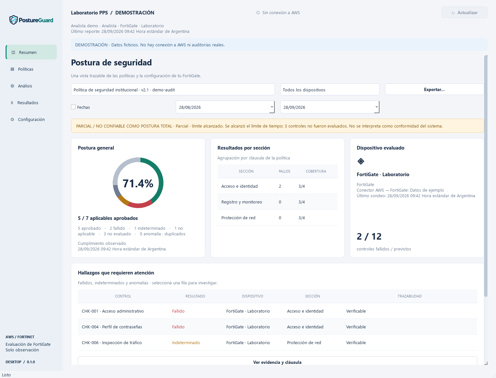

# PPS Desktop

Aplicación de escritorio **PySide6** para `SPEC_GUI_PPS_AWS_FORTINET.md` (v1.1).
Primera plataforma: Windows 10/11 x64, Python 3.11 o superior. No abre un
servidor de aplicación ni se conecta directamente a FortiGate, Lambda o Secrets Manager.

## Ejecutar

Desde la raíz del repositorio, en PowerShell:

```powershell
python -m venv .venv-gui
.\.venv-gui\Scripts\python -m pip install -e './desktop[dev]'
.\.venv-gui\Scripts\python desktop/launch.py --demo
```

Para iniciar sin datos ficticios:

```powershell
.\.venv-gui\Scripts\python desktop/launch.py
```

También se puede abrir `desktop/dist/PPS-Desktop.exe` después de
compilar. El modo demostración está disponible en **Configuración**.

## Funciones implementadas

- Resumen: cumplimiento observado, cobertura, agrupación por sección, dispositivo
  y tabla de hallazgos. Cada ejecución conserva versión, hora local, `run_id` y hash.
- Políticas: búsqueda, filtros por estado/dispositivo/fecha, carga PDF/DOCX por diálogo
  nativo o arrastre, hash SHA-256, validación preliminar de tamaño y cabecera,
  detalle de controles/versiones y vista previa textual cuando el servicio la ofrece.
- Análisis: fases confirmadas, errores, sondeo cada 4 segundos durante ejecuciones
  activas y espera progresiva hasta 60 segundos al perder conexión.
- Resultados: filtros, evidencia, cláusula verificable, endpoints y exportación JSON/Markdown.
  Duplicados y observaciones desconocidas se conservan para investigación.
- Configuración: inicio de sesión OIDC Authorization Code + PKCE en navegador del sistema,
  roles informados por el servidor, cierre de sesión, tamaño de texto y borrado de caché.
- Caché cifrada Fernet con clave en el almacén de credenciales del sistema, caducidad de
  24 horas y separación por API/organización/usuario. Si no hay almacén seguro, no se
  persiste caché. Preferencias sin secretos en `QSettings`; tokens únicamente en memoria.
- Ventana adaptable: tres, dos o una columna; tablas desplazables y navegación por teclado.
  `Ctrl+O`: abrir reportes. `F5`: actualizar. Botones explícitos permiten abrir una fila sin ratón.



## Tres fuentes claramente diferenciadas

**Demostración:** datos ficticios deterministas, sin red, sin subida, sin ejecución ni
seguimiento remoto. Sirve para recorrer todas las pantallas y exportar una vista de ejemplo.

**Archivos locales:** en Políticas o Configuración, elegir primero `manifest.json` y luego
`report.json` del pipeline. Se comprueba que correspondan al mismo `run_id` y política.
No se infiere el dispositivo, organización ni versión a partir del nombre del archivo.
El manifest no se ejecuta y el script generado no se abre. Los archivos importados no se
guardan en la caché de una organización autenticada.

**Servicio conectado:** requiere implementar y desplegar la API de
[API_CONTRACT.md](API_CONTRACT.md), configurar su URL, emisor OIDC, client ID público,
scopes y audience cuando corresponda. El proveedor debe admitir redirect loopback con
puerto efímero `http://127.0.0.1:{port}/callback` para un cliente nativo público y PKCE S256.
El listener se abre solo en loopback durante el inicio de sesión (máximo 120 segundos).
No se usan client secrets ni claves AWS permanentes. La API valida el access token y la
pertenencia a la organización; la aplicación no deduce permisos de un JWT sin verificar.

## Alcance real y pendientes de infraestructura

Esta entrega implementa **la GUI y el cliente del contrato remoto**. El repositorio original
no contiene esa API, una base de metadatos multiusuario ni un proveedor de identidad.
No se han creado recursos AWS ni modificado el pipeline para fingir que existen.

Por tanto, una auditoría real desde esta GUI todavía requiere:

1. API autenticada, persistencia e índices, autorización por organización/dispositivo
   en cada endpoint y registro de acciones sensibles.
2. Registro previo de auditoría y correlación entre objeto S3, `audit_id` y `run_id`.
   Generador y ejecutor deben persistir fases y errores reales.
3. Validación **servidor** de documentos, hash, tamaño, formato y permisos; el chequeo local
   es preliminar. Extracción de PDF cifrado, escaneado o corrupto sigue siendo del pipeline.
4. Sondeo de FortiGate desde AWS, no desde el equipo del analista.
5. Disparador desacoplado y endpoint de seguimiento si se habilitan esas capacidades.
6. Definir política institucional de retención, tratamiento de IA y firma/distribución.

El botón «Cargar e iniciar» corresponde al comportamiento actual del pipeline. «Volver a
analizar» y «Guardar seguimiento» solo se habilitan si el servidor anuncia soporte y el
rol tiene permisos. No hay aprobación humana simulada, remediación, ranking inventado,
letras A–F ni severidades/puntuaciones deducidas.

La administración de usuarios/conectores/retención y la aprobación de controles quedan
en el servicio por implementar. La vista previa de documentos es textual, no un editor
PDF/DOCX. No hay actualizador automático ni firma de código. La accesibilidad con un lector
de pantalla real y las pruebas con el IdP institucional requieren validación en destino.

## Cálculos

Universo = IDs únicos del manifest. Un ID duplicado en el manifest o en los hallazgos se
marca como **anomalía** y se excluye de cobertura/cumplimiento; se conservan las entradas.
Un hallazgo ajeno al manifest no aumenta el denominador ni los aprobados.

- Cobertura = `(pass + fail + indeterminate + not_applicable) / previstos`.
- Cumplimiento observado = `pass / (pass + fail)`; sin denominador, «Sin datos suficientes».
- Faltantes = `not_evaluated`; se muestran las exclusiones junto a la métrica.
- Fallos, truncamiento, anomalías o cobertura incompleta llevan aviso de postura parcial.
- Una referencia requiere `traceable=true` **y** una cita no vacía; nunca se fabrica a partir
  de otra observación o de una cláusula esperada.

El servicio remoto debe calcular los mismos agregados. La GUI recalcula sobre el par
manifest/reporte completo para ofrecer la misma semántica al importar archivos y detectar
inconsistencias; no utiliza scores del flujo NIST legado como si fueran comparables.

## Compilar e instalar para Windows

```powershell
./desktop/scripts/Build-Windows.ps1
./desktop/scripts/Install-PPS.ps1
```

Si la política de PowerShell impide ejecutar scripts, se puede compilar directamente
sin modificar esa política:

```powershell
cd desktop
../.venv-gui/Scripts/python -m PyInstaller --noconfirm --distpath . PPS-Desktop.spec
```

En ese caso, la distribución también funciona de forma portable; la instalación por
script queda sujeta a la política de ejecución institucional.

El build es una distribución **onedir**: conservar la carpeta completa, no copiar solo el
`.exe`. El instalador PowerShell copia la distribución a `%LOCALAPPDATA%/Programs/PPS-Desktop/0.1.0`
y crea un acceso directo en el menú Inicio del usuario, sin privilegios de administrador.
El script de instalación se ejecuta a petición del usuario; compilar no instala ni abre ventanas.
Para actualizar, compilar la versión nueva y ejecutar su instalador. Antes de distribuir a
otros equipos se debe firmar el ejecutable con el certificado de la institución.

## Verificación

```powershell
.\.venv-gui\Scripts\python -m pytest -q desktop/tests
.\.venv-gui\Scripts\python -m ruff check desktop
.\.venv-gui\Scripts\python desktop/scripts/capture.py
# Dependencias y pruebas existentes del pipeline:
.\.venv-gui\Scripts\python -m pip install -r audit-pipeline/lambda/requirements.txt pytest-mock 'moto[s3,secretsmanager]' boto3
.\.venv-gui\Scripts\python -m pytest -q -c audit-pipeline/pyproject.toml audit-pipeline/lambda/tests
```

Las pruebas nuevas ejercitan contratos, duplicados, estados parciales, autorización visual,
caché cifrada/expirada, transporte de subida, filtros, teclado y cambio de ancho. No sustituyen
una prueba de autorización del backend con un cliente modificado, S3 → eventos → API, ni una
prueba de instalación en una máquina limpia. Ver [docs/VALIDATION.md](docs/VALIDATION.md).

Referencias usadas: [Qt, hilos y señales](https://doc.qt.io/qtforpython-6/examples/example_widgets_thread_signals.html)
y [RFC 8252, OAuth para aplicaciones nativas](https://www.rfc-editor.org/info/rfc8252/).
